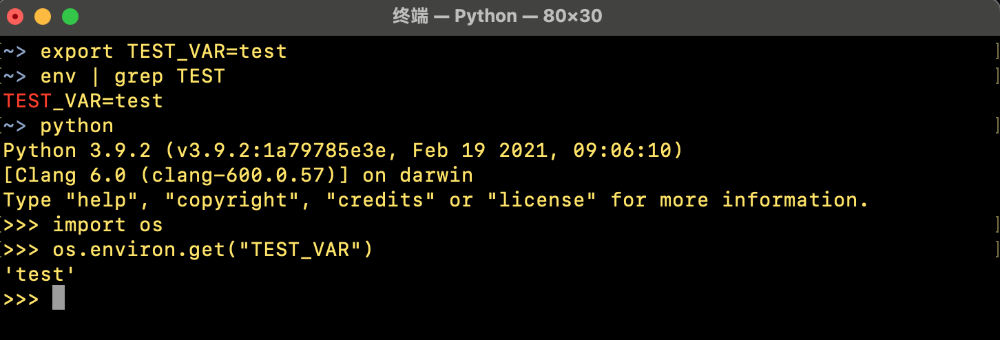
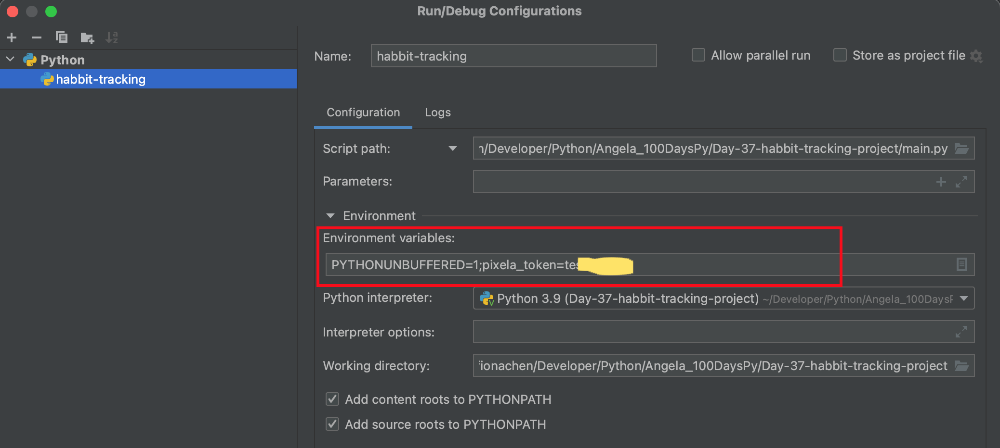

# Using Environment Variables in Python

As we begin to sending Emails or using APIs with authorizations, we need to code our password or API keys in our code. However it is not very safe to just hard code the password or private keys in the code, especially when we want to upload our code to the public repositories. In this case, we can use environment variables. Those variables are stored locally.

In this documentation, I will introduce three different ways to use einvironment variables. 

## 1. Export Environment Variables in Terminal

The easiest way to define a environment variable is to use **"export"** command. As shown in the graphic below, we export a variable called "TEST_VAR" and then we can use it in python environment.

The problem here is we cannot access the variable in Atom or in Pycharm. As shown below, we try to access the variable in our Atom environmant and it retruns *None* which causes a traceback later when we run the code. 

And if we close the terminal window and restart a new terminal, the variable is gone. 

In order to solve this problem, we can export the variable permanantly into system file.

## 2. Export Environment Variables into the System File

In order to export the variable permanently, we have to write the export command in .bash_profile file. 

As shown in the graphic below, I added a bounch of API keys into the system file and then I can use them through **os** library in all the develop environment.

> HINT: After export the variables, you have to restart your develop tools such as Atom or Pycharm, so that they can refresh the env list to get to newly defined variables. Without restart, they will keep return *None* to you.

## 3. Using .env File to Define the Environment Variables

However, we might not want to messing up with the system file. In this case, we can use a ".env" file to define our environment variables. Within the same folder we can create a new file named ".env". Within this new file, we can define all the variables we want. 

> Please remember, when we define the environment variables, we do not write space before and after the "=" sign.

And in order to access the variables in the file, we have to install a python package which is here a little bit confusing. The package called **"python-dotenv"** instead of **"dotenv"**. If you try to install "dotenv" you will get an error message. 

In pyCharm it is more confusing, as pyCharm will automatically inform us that the **dotenv** package is not installed. If we try to install it directly, we get errors. 

In pyCharm we have to go to the "reference" and from there we can search "python-dotenv" package and install it. After that everything works fine. 

## 4. Define Environment Variables Directly in PyCharm Project

Pychar is a very smart and strong develop tool and we can even directly define the environment variables in the pyCharm project.

First of all, we should goto the "run" menu and choose "Edit Configurations" from there.

Within the configurations, we can add a new configuration, give it a name and set the "script path". Then below we can see a file with "environment variables", we can just input our variables there. And then we can use this variable in our project. Since this is the configuration of this project, the variable is only valid within this project.

This is all the ways to introduce environment varialbes into python project. Hope you will find them useful.

